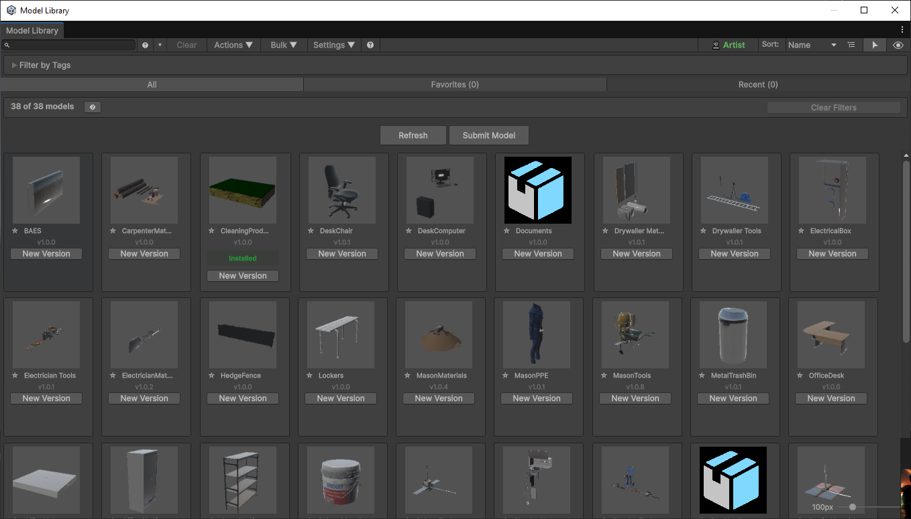
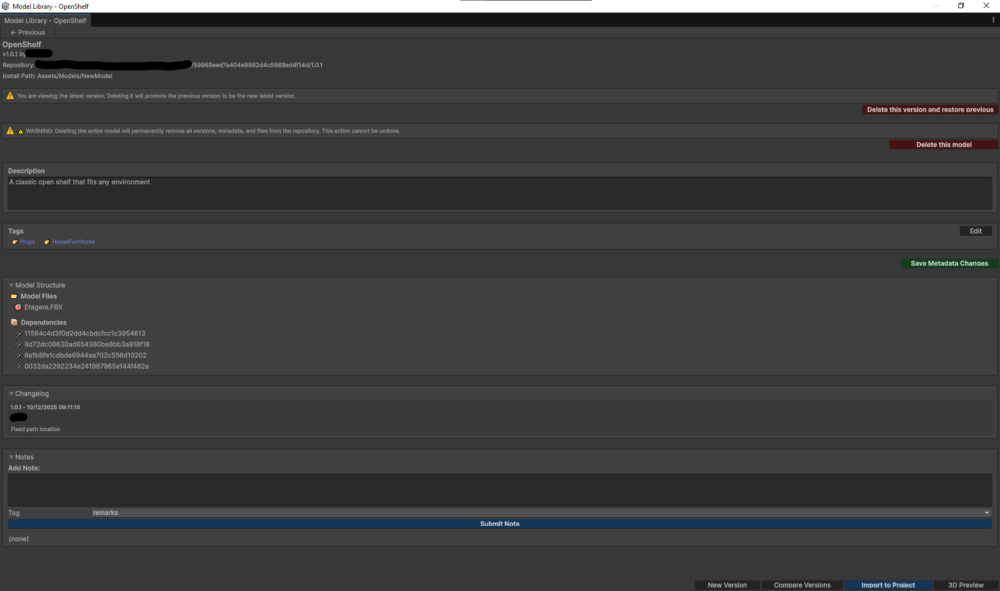
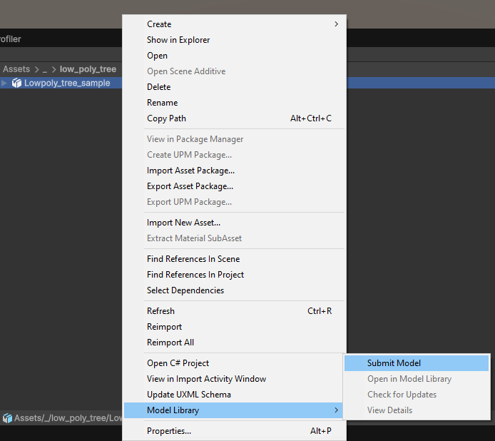
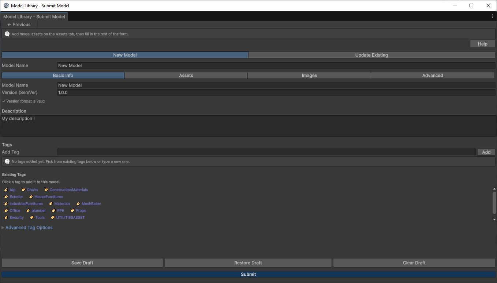
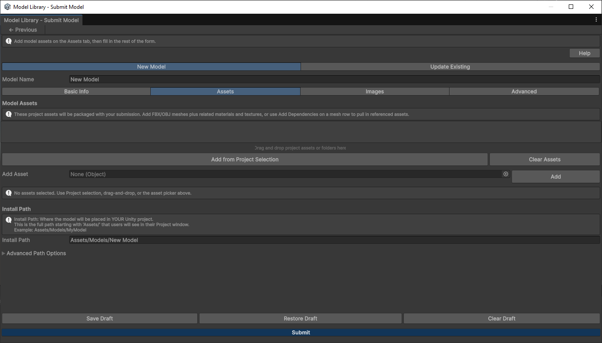

# Models Library

Editor tools for browsing, versioning, submitting, and importing 3D models from a shared repository. Package `com.models-library`, version 1.0.12. Unity 6000.2 or later. Editor only.

These pages and screenshots ship inside the package under `Documentation~`. You can read them without opening GitHub. The pictures show the current Editor windows. The models in the pictures are an example catalog; they are not included. The included sample is **Sample Cube**.

## Install

In Package Manager, choose **Add package from git URL** and enter:

```text
https://github.com/PierreGac/Unity-ModelsLibrary.git
```

`package.json` is at the repository root. Pin `#v1.0.12`, or `#main` for the default branch. For a local clone, choose **Add package from disk** and select that root `package.json`.

Then open **Tools > Model Library** and finish the first-run wizard: your name, your role, and the repository.

## Sample

Package Manager lists an **Example** sample. Import it, then point Model Library at the imported `Repository` folder. Open **Sample Cube** and choose **Import to Project**. The mesh is `Cube.obj`.

## Browse

The browser searches the catalog, filters by tags, and switches among All, Favorites, and Recent. **Refresh** reloads the index. **Submit Model** opens the submission form. Cards show the version and an **Installed** or **New Version** action.



**Actions** refreshes, checks for updates, or submits. **Bulk** selects several models for import or update, and can open batch upload. **Settings** opens help, shortcuts, repository settings, the error log, the profiler, analytics, and the setup wizard.

Roles are **Developer**, **Artist**, and **Admin**. They only show or hide Editor actions. They are not a security boundary. A shared folder needs its own permissions. An HTTP server needs its own authentication.

## Model details

Open a card to see description, tags, files, changelog, and notes. **Import to Project** copies the payload into the project. The default folder is `Assets/Models/<ModelName>/`. An installed model with a newer repository version offers **Update**. **Compare Versions** and **3D Preview** open from the same footer. **New Version** opens Update Existing for that model.



Deleting the latest version promotes the previous one. **Delete this model** removes the catalog entry. Both actions are permanent on a file-system repository.

## Submit

Select an FBX or OBJ in the Project window, then use **Submit Model** or **Assets > Model Library > Submit Model**.



The other context actions are **Open in Model Library**, **Check for Updates**, and **View Details**.

**New Model** creates an entry. **Update Existing** adds a version and asks for a changelog summary. Basic Info holds the name, SemVer version, description, and tags. The form can save, restore, and clear a draft.



A submission must include at least one FBX or OBJ. Materials, textures, and preview images can travel with that mesh. A folder that has only metadata or images is rejected.



The Assets tab sets the install path. That path is where the model appears in the importing project, and it must start with `Assets/`.

## Repository

Use a file-system folder or a UNC share. This is the supported setup.

```text
<repository-root>/
  models_index.json
  <modelId>/
    <version>/
      model.json
      payload/
      images/
```

Settings are stored in `ProjectSettings/ModelLibrarySettings.json`. The local cache defaults to `Library/ModelLibraryCache`.

## HTTP

HTTP is experimental. Prefer a shared folder.

- Index rebuild runs only for a file-system repository.
- Delete version and delete model do not run over HTTP. The Editor logs a warning and leaves the repository unchanged. A server would need its own DELETE endpoints.
- Editor roles do not authorize HTTP requests. The server has to authenticate and authorize them.

## After import

Each install folder gets a hidden `.modelLibrary.meta.json`. An older `modelLibrary.meta.json` is still recognized. If Unity asks about GUID conflicts, choose **Keep** when existing references must stay.

## Third-party components

This package includes no third-party components.
