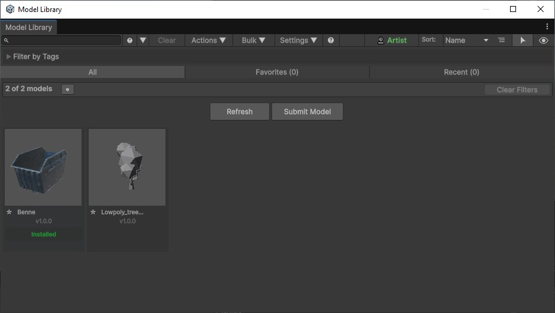
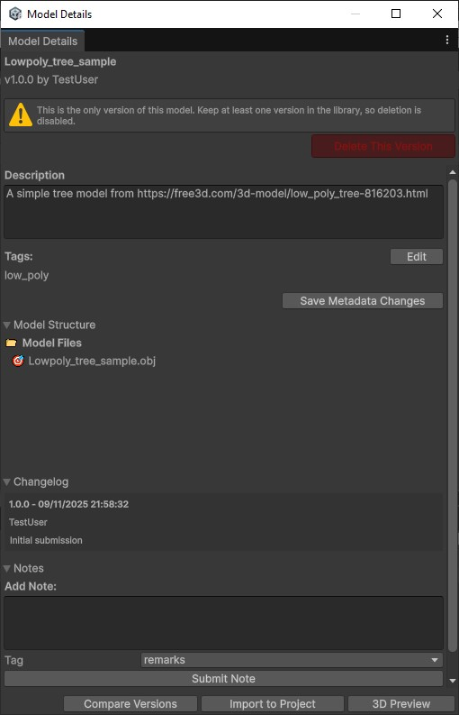
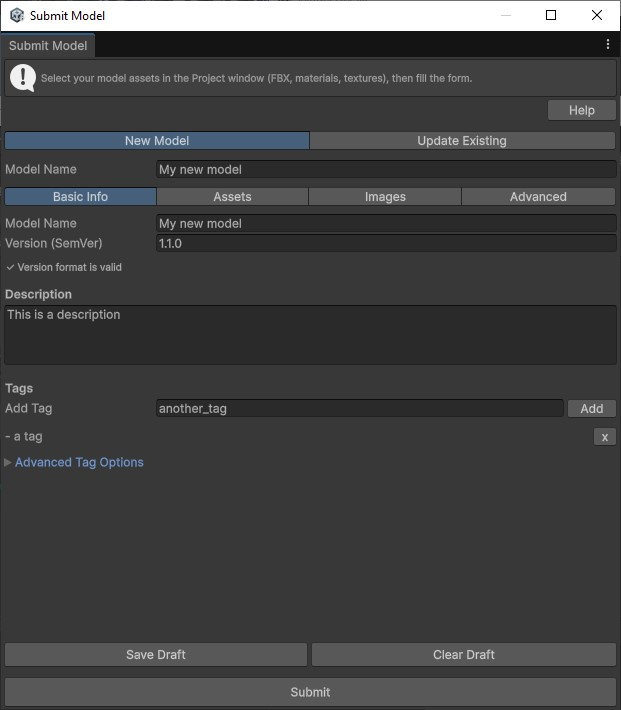

# Model Library for Unity

A comprehensive Unity Editor tool that enables teams to version, browse, submit, and import 3D models (FBX, OBJ, materials, textures) from a shared repository. Features include intelligent caching, automatic update detection, role-based permissions, and seamless integration with Unity's asset pipeline.


## 🎯 Key Features

- **📦 Browser Window** - Search, filter, and browse models with grid/list views
- **✅ Installation Status** - Visual badges showing which models are installed
- **🔄 Automatic Updates** - Detects and manages model updates with version comparison
- **📤 One-Click Import** - Import models directly into your project with preserved GUIDs
- **📝 Model Submission** - Submit new models or update existing ones with smart name prefilling
- **🏷️ Tag System** - Organize models with tags and filter by them
- **⭐ Favorites & Recent** - Quick access to frequently used models
- **📊 Analytics** - Track model usage and statistics (Admin/Artist roles)
- **👥 Role-Based Access** - Developer, Artist, and Admin roles with appropriate permissions
- **💬 Notes System** - Leave feedback and notes on models
- **📋 Changelog Tracking** - Version history with detailed changelog entries
- **🖼️ Preview Images** - High-resolution preview thumbnails
- **🔍 Smart Search** - Search by name, tags, or description
- **📦 Bulk Operations** - Batch import, update, and tag management
- **⚙️ Hidden Metadata** - Manifest files automatically hidden from Project window
- **🔄 Auto-Refresh** - Browser automatically refreshes after model submission

## 🚀 Quick Start

### 1. Open the Browser Window

- Unity menu: `Tools > Model Library > Browser`
- On first run, the setup wizard guides you through configuration

### 2. Configure Repository

The first-run wizard helps you set up:

- **Repository Type**:
  - **File System**: A shared folder accessible to your team
  - **HTTP**: A web endpoint implementing the repository interface. This approach needs testing. The development have been done only with Windows Explorer.
- **Repository Root**: Path or base URL to your model repository
- **User Identity**: Your name and role (Developer, Artist, or Admin)

### 3. Browse and Import Models

- Use the search bar to find models by name or tags
- Click on a model card to view details
- Use the "Import to Project" button to add models to your Unity project
- Installed models show a green "Installed" badge

### 4. Submit Models

- Unity menu: `Tools > Model Library > Submit Model`
- Or right-click on assets in Project window: `Submit Model`
- Select your model assets (FBX, OBJ, materials, textures)
- Fill in metadata (name, version, description, tags)
- Submit as a new model or update an existing one

## 📸 Visual Tour

### Browser Window

The main browser window provides a comprehensive view of all available models with search, filtering, and quick access to common operations.



**Key Features Visible:**

- **Search Bar**: Filter models by name or tags
- **View Modes**: Toggle between Grid and List views
- **Filter Tabs**: All, Favorites, and Recent models
- **Installed Badge**: Green "Installed" label on models already in your project
- **Update Indicators**: Visual cues for models with available updates
- **Action Buttons**: Refresh, Submit Model, Bulk Operations
- **User Role Display**: Current user role (Developer/Artist/Admin)
- **Sort Options**: Sort by name, date, or version

### Model Details Window

View comprehensive information about a specific model, including metadata, version history, changelog, and notes.



**Features:**

- **Model Information**: Name, version, author, description
- **Installation Status**: Shows if model is installed and current version
- **Update Detection**: "Update Available" button when newer version exists
- **Model Structure**: View all files included in the model
- **Changelog**: Version history with dates and authors
- **Notes System**: Add and view feedback notes
- **Metadata Editing**: Edit description and tags (requires Artist/Admin role)
- **Version Management**: Delete old versions (requires Artist/Admin role)
- **Import/Update**: One-click import or update to latest version
- **3D Preview**: Launch interactive 3D preview window

### Submit Model Window

Submit new models or update existing ones with a comprehensive form and validation.



**Features:**

- **Mode Selection**: New Model or Update Existing
- **Smart Name Prefilling**: Automatically extracts name from:
  1. FBX/OBJ file name (e.g., "MyModel.fbx" → "MyModel")
  2. Folder name (if no FBX/OBJ selected)
  3. Existing model manifest (if asset belongs to installed model)
- **Tabbed Interface**: Basic Info, Assets, Images, Advanced
- **Version Validation**: Semantic versioning (SemVer) format validation
- **Tag Management**: Add and remove tags
- **Image Upload**: Drag-and-drop preview images
- **Draft Saving**: Save work in progress and resume later
- **Inline Validation**: Real-time feedback on form fields
- **Changelog Entry**: Required for updates with change summary

## 🎨 Detailed Features

### Installation Status Detection

- **Visual Indicators**: Green "Installed" badge on model cards
- **Version Tracking**: Shows installed version vs. latest available
- **Update Detection**: "Update Available" badge when newer version exists
- **Automatic Detection**: Scans project for manifest files to detect installations
- **Backward Compatibility**: Supports both old and new manifest file naming conventions

### Smart Name Prefilling

When submitting a model, the system intelligently prefills the model name:

1. **Priority 1**: Extract from FBX/OBJ file name
   - `MyModel.fbx` → `MyModel`
   - `Character_01.obj` → `Character_01`

2. **Priority 2**: Extract from folder name
   - If no FBX/OBJ is directly selected, uses parent folder name

3. **Priority 3**: Extract from existing model manifest
   - If selected assets belong to an already-installed model, uses that model's name

### Hidden Metadata Files

- Manifest files (`.modelLibrary.meta.json`) are automatically hidden from Unity's Project window
- Uses dot-prefix naming convention (`.modelLibrary.meta.json`) to leverage Unity's native hiding
- Backward compatible with old naming (`modelLibrary.meta.json`)
- Files remain accessible programmatically but don't clutter the Project view

### Automatic Refresh

- Browser window automatically refreshes after model submission
- No need to manually refresh or reopen the window
- Index and manifest cache are updated automatically
- All open browser windows are synchronized

### Role-Based Permissions

**Developer Role:**

- Browse and import models
- View model details
- Leave notes and feedback
- Cannot submit or delete models

**Artist Role:**

- All Developer permissions
- Submit new models
- Update existing models
- Edit metadata (description, tags)
- Delete model versions
- Access analytics

**Admin Role:**

- All Artist permissions
- Full system access
- Advanced analytics
- System management

### Notes System

- Add notes to models with tags (remarks, bug, feature request, etc.)
- Notes are shared across all versions of a model
- View note history in the Model Details window
- Notes include author, timestamp, and tag

### Changelog Tracking

- Automatic changelog entry creation on updates
- Required change summary for version updates
- View full version history in Model Details window
- Changelog entries include version, date, author, and summary

### Bulk Operations (needs testing)

- **Bulk Import**: Import multiple models at once
- **Bulk Update**: Update multiple installed models
- **Bulk Tagging**: Add or remove tags from multiple models
- **Batch Upload**: Upload multiple models from a directory

### Search and Filtering

- **Text Search**: Search by model name, description, or tags
- **Tag Filtering**: Filter by specific tags using the tag foldout
- **View Modes**: Grid view (with thumbnails) or List view (compact)
- **Sort Options**: Sort by name, date, or version
- **Favorites**: Mark models as favorites for quick access
- **Recent**: View recently used models

### Update Detection (needs testing)

- Automatic background checking for model updates
- Visual indicators for models with available updates
- Version comparison using Semantic Versioning (SemVer)
- One-click update to latest version
- Preserves local customizations during updates

### Preview System

- High-resolution preview thumbnails in grid view
- 3D interactive preview window
- Automatic thumbnail generation
- Support for multiple preview images per model

## 🔧 Configuration

### Repository Settings

Configure your model repository in `Tools > Model Library > Settings`:

- **Repository Type**: File System or HTTP
- **Repository Root**: Path or URL to repository
- **Cache Location**: Local cache directory for downloaded models

### User Settings

Set your identity and preferences:

- **User Name**: Your display name for submissions and notes
- **User Role**: Developer, Artist, or Admin
- **Preferences**: Various UI and behavior preferences

### First-Run Wizard

On first launch, a guided wizard helps you:

1. Set your user name
2. Choose repository type
3. Configure repository location
4. Set initial preferences

## 📋 Workflows

### Browsing and Importing

1. Open the Browser window (`Tools > Model Library > Browser`)
2. Use search or filters to find models
3. Click on a model card to view details
4. Click "Import to Project" to add to your project
5. Model is copied to `Assets/Models/[ModelName]/` with preserved GUIDs

### Updating Models

1. Models with updates show an "Update Available" badge
2. Open Model Details window for the model
3. Click "Update" button (replaces "Import" when update available)
4. System updates to latest version while preserving local files

### Submitting New Models

1. Select model assets in Project window (FBX, OBJ, materials, textures)
2. Right-click → `Submit Model` or use menu `Tools > Model Library > Submit Model`
3. Model name is automatically prefilled (if possible)
4. Fill in version, description, and tags
5. Add preview images (optional)
6. Click "Submit"
7. Browser window automatically refreshes to show new model

### Updating Existing Models

1. Open Submit window and select "Update Existing" mode
2. Choose the model to update from dropdown
3. Version is auto-suggested (patch bump from latest)
4. Enter change summary (required)
5. Modify description, tags, or assets as needed
6. Click "Submit"
7. New version is created with updated metadata

### Managing Metadata

1. Open Model Details window for any model
2. Click "Edit" next to Description or Tags
3. Make changes (requires Artist/Admin role)
4. Click "Save Metadata Changes"
5. Changes create a new metadata version

### Adding Notes

1. Open Model Details window
2. Scroll to "Notes" section
3. Enter note text
4. Select note tag (remarks, bug, feature request, etc.)
5. Click "Submit Note"
6. Note is saved and visible to all users

## 🏗️ Architecture

### Repository Layout

```
<repository-root>/
  models_index.json              # Master index of all models
  <modelId>/
    <version>/
      model.json                 # Version metadata
      payload/                    # Model files (FBX, materials, textures)
        <files and dependencies>
      images/                     # Preview images and screenshots
        <preview images>
```

### Local Cache

- Downloads are cached under a configurable library path
- Cache location set in Settings
- Import copies from cache into `Assets/` folder
- GUIDs are preserved for reliable update detection

### Metadata Structure

**Index (`models_index.json`):**

- List of all models with latest version
- Includes: id, name, latest version, description, tags, timestamps

**Model Metadata (`model.json`):**

- Identity (id, name)
- Version (SemVer format)
- Description and tags
- Author and timestamps
- Asset GUIDs (for update detection)
- Payload paths
- Changelog entries
- Notes
- Preview image references

### Manifest Files

Each imported model creates a manifest file in the installation directory:

- **File Name**: `.modelLibrary.meta.json` (hidden from Project window)
- **Location**: `Assets/Models/[ModelName]/.modelLibrary.meta.json`
- **Purpose**: Tracks installed model ID and version
- **Backward Compatible**: Also supports old naming `modelLibrary.meta.json`

## 🛠️ Development

### Project Structure

```
Assets/ModelLibrary/
  Editor/
    Windows/                      # Editor windows
      ModelLibraryWindow.cs      # Main browser window
      ModelDetailsWindow.cs      # Model details and import
      ModelSubmitWindow.cs       # Model submission form
      ModelVersionComparisonWindow.cs  # Version comparison
      ModelBulkTagWindow.cs      # Bulk tag editor
      BatchUploadWindow.cs       # Batch upload interface
      UserSettingsWindow.cs      # User preferences
      UnifiedSettingsWindow.cs   # Repository settings
      AnalyticsWindow.cs         # Usage analytics
      ModelPreview3DWindow.cs   # 3D preview
      ...
    Infrastructure/
      Repository/                # Storage backends
        IModelRepository.cs      # Repository interface
        FileSystemRepository.cs # File system implementation
        HttpRepository.cs       # HTTP implementation
      Services/                  # Business logic
        ModelLibraryService.cs   # Main service facade
        ModelIndexService.cs     # Index management
        ModelMetadataService.cs  # Metadata operations
        ModelPreviewService.cs  # Preview generation
        ModelScanService.cs     # Project scanning
        ModelDeployer.cs        # Model deployment
        ModelProjectImporter.cs # Project import
        ...
      Utils/                     # Utilities
        JsonUtil.cs              # JSON serialization
        SemVer.cs                # Version parsing
        PathUtils.cs             # Path utilities
        AssetVisibilityUtility.cs # File hiding
        ...
    ScriptableSettings/          # Settings
      ModelLibrarySettings.cs    # Repository settings
      SimpleUserIdentityProvider.cs # User identity
    Tests/                       # Unit tests
      ...
  Data/                          # Data models
    ModelMeta.cs                 # Model metadata
    ModelIndex.cs                # Index structure
    ModelNote.cs                   # Notes
    ModelIdentity.cs             # Model identity
    Tags.cs                      # Tag system
  Documentation~/                # Documentation assets
    browser.jpg                  # Browser screenshot
    existing_model_details.jpg   # Details window screenshot
    submit_01.jpg                # Submit window screenshot
```

### Key Components

**ModelLibraryService**: Main facade service that coordinates all operations

- Index management
- Metadata operations
- Preview generation
- Project scanning
- Update detection

**ModelIndexService**: Handles index operations

- Loading and caching index
- Refreshing index
- Version queries

**ModelMetadataService**: Manages model metadata

- Loading metadata
- Publishing updates
- Version file cloning

**ModelScanService**: Scans Unity project for installed models

- Manifest file discovery
- Installation status detection
- Version matching

### Building and Running

- No build step required
- Open Unity project and use menu commands
- Editor-only code (no runtime components)
- Compatible with Unity 2022+ and Unity 6

### Testing

Comprehensive unit test suite covering:

- Asset visibility and hiding
- Manifest file discovery
- Model name prefilling
- Installation detection
- Version management
- Bulk operations
- Settings and permissions
- Refresh operations

Run tests via Unity Test Runner: `Window > General > Test Runner`

## 🔌 Extensibility

### Repository Interface

Implement `IModelRepository` to add custom storage backends:

```csharp
public interface IModelRepository
{
    Task<ModelIndex> GetIndexAsync();
    Task<ModelMeta> GetMetaAsync(string modelId, string version);
    Task SaveIndexAsync(ModelIndex index);
    // ... more methods
}
```

### Metadata Extension

The `model.json` schema includes flexible fields:

- `extra`: Dictionary for custom metadata
- `dependencies`: Dependency references
- Extend without breaking schema changes

### Custom Services

Services are designed for dependency injection:

- Implement service interfaces
- Replace default implementations
- Extend functionality without modifying core

## 📚 Additional Windows

### Version Comparison Window

Compare two versions of a model side-by-side:

- View differences in metadata
- Compare asset lists
- Review changelog entries
- Access via Model Details window

### Bulk Tag Editor

Manage tags for multiple models:

- Select multiple models
- Add or remove tags in bulk
- Generate changelog entries for tag changes

### Analytics Window

View model usage statistics (Artist/Admin only):

- Import history
- Most used models
- User activity
- Version distribution

### 3D Preview Window

Interactive 3D preview of models:

- Rotate and zoom
- Material preview
- Lighting controls
- Export preview images

### Performance Profiler

Monitor async operation performance:

- Operation timing
- Cache hit rates
- Performance metrics

### Error Log Viewer

Review and manage errors:

- Recent error log
- Error suppression
- Debug information

## 🤝 Contributing

Contributions are welcome! Suggested areas:

- Enhanced preview generation
- Additional bulk operations
- CI/CD integration helpers?
- Performance optimizations, especially for the server interactions
- UI/UX improvements
- Documentation improvements

### Development Guidelines

- No `var` declarations (explicit types required)
- Use `for` loops instead of `foreach` for arrays/lists
- No magic numbers (use named constants)
- Comprehensive XML documentation
- .NET Standard 2.1 compatibility

Please open an issue to discuss significant changes before submitting a PR.

## 📝 License

MIT License - see LICENSE file for details

## 🙏 Acknowledgements

- Unity and the Editor ecosystem
- Contributors and teams using this workflow
- Open source community

## 📖 Additional Resources

- **Help Window**: `Tools > Model Library > Settings > Help / Documentation`
- **Keyboard Shortcuts**: `Tools > Model Library > Settings > Keyboard Shortcuts`
- **Architecture Documentation**: See `architecture.md` for detailed design

---

**Note**: This tool is Editor-only and does not include any runtime components. All functionality is available only within the Unity Editor.
